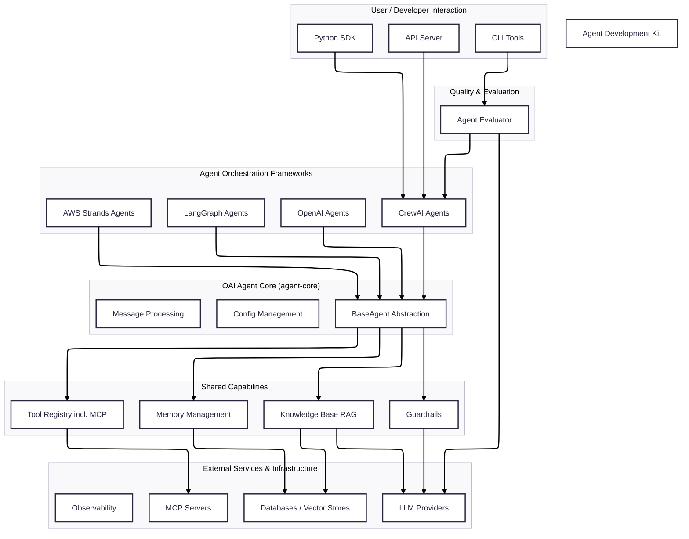
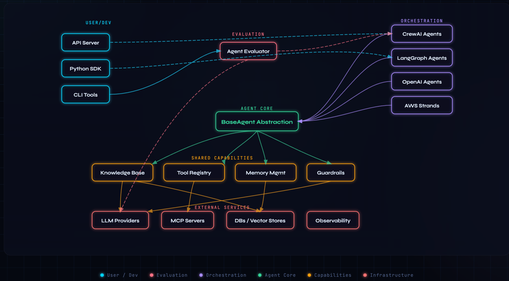

# OAI Agent Development Kit (ADK)

A robust, modular, and extensible framework for building, serving, and evaluating AI agents. This development kit provides a unified interface to orchestrate intelligent agents across various underlying frameworks like **CrewAI**, **LangGraph**, **OpenAI**, and **AWS Strands**.

## 📋 Table of Contents

- [Overview](#-overview)
- [Key Features](#-key-features)
- [Architecture Diagram](#-architecture-diagram)
- [Project Structure](#-project-structure)
- [Core Frameworks](#-core-frameworks)
- [Shared Capabilities](#-shared-capabilities)
- [Serving & Evaluation](#-serving--evaluation)
- [Quick Start](#-quick-start)

## 🌟 Overview

The OAI Agent Development Kit (ADK) simplifies the creation of complex multi-agent systems by providing a declarative, YAML-based configuration layer over popular agentic frameworks. It standardizes how agents access tools, manage memory, interact with knowledge bases (RAG), and integrate with observability platforms.

## 🚀 Key Features

*   **Multi-Framework Support**: Choose the best engine for your use case (CrewAI, LangGraph, OpenAI, or AWS Strands).
*   **Unified Abstractions**: Consistent `BaseAgent` interface across all implementations.
*   **YAML-Driven Configuration**: Define agents, tasks, tools, and orchestration patterns without writing boilerplate code.
*   **Advanced RAG**: Built-in support for Knowledge Bases with multiple vector stores (ChromaDB, pgvector, S3) and data sources (Local, S3).
*   **Long-Term Memory**: Persistent semantic memory to maintain context across sessions.
*   **MCP Integration**: Seamlessly connect to Model Context Protocol (MCP) servers.
*   **Guardrails**: Integrated input/output validation using Guardrails AI.
*   **Observability**: First-class support for Langfuse tracing and monitoring.
*   **Production Ready**: Includes a high-performance FastAPI server and a comprehensive evaluation framework.

## 🏗️ Architecture Diagram

Here's a simplified overview of the OAI ADK's layered architecture:




## 📂 Project Structure

The ADK is organized as a monorepo containing several specialized packages:

| Package | Description |
| :--- | :--- |
| [`agent-core`](./packages/agent-core) | Foundational abstractions, shared components, and base classes. |
| [`mcp-core`](./packages/mcp-core) | Enterprise-grade framework for building Model Context Protocol (MCP) servers. |
| [`crewai-core`](./packages/crewai-core) | Implementation for CrewAI-based multi-agent orchestrations. |
| [`langgraph-core`](./packages/langgraph-core) | Implementation for stateful LangGraph/LangChain workflows. |
| [`openai-core`](./packages/openai-core) | Implementation for OpenAI's native agent framework. |
| [`aws-strands-core`](./packages/aws-strands-core) | Implementation for AWS Bedrock Strands multi-agent SDK. |
| [`agent-server`](./packages/agent-server) | FastAPI-based server for hosting and managing agents. |
| [`agent-evaluator`](./packages/agent-evaluator) | Regression testing and LLM-as-a-Judge evaluation framework. |

## 🤖 Core Frameworks

Each core package allows you to define complex orchestration patterns via YAML:

*   **CrewAI**: Supports `sequential` and `hierarchical` processes.
*   **LangGraph**: Supports `supervisor`, `swarm`, and `agent-as-tool` patterns.
*   **OpenAI**: Supports `supervisor`, `handoff`, and `agent-as-tool` patterns.
*   **AWS Strands**: Supports `graph`, `swarm`, `sequential`, and `agents_as_tools` patterns.

## 🛠️ Shared Capabilities

All agent implementations benefit from the shared features provided by `agent-core`:

### Knowledge Base & Data Sources
Ground your agents in custom data using the built-in RAG system.
*   **Vector Stores**: Chroma (local), Postgres (enterprise), S3 (serverless).
*   **Loaders**: Automatically sync and index files from local directories or AWS S3 buckets.

### Tools & MCP
*   **Standard Tools**: Load LangChain community tools or custom Python functions.
*   **MCP Servers**: Connect to any MCP-compliant server for filesystem, database, or API access.

### Memory & Guardrails
*   **Memory**: Short-term (recent turns) and long-term (semantic retrieval) persistent memory.
*   **Guardrails**: Validate inputs and outputs against competitors, PII, or custom logic.

## 🔌 MCP Server Development (`mcp-core`)

The `mcp-core` package provides an enterprise-ready framework for building custom MCP servers. It extends `FastMCP` with:
*   **Request Isolation**: Thread-safe handling of concurrent requests with isolated environment variables.
*   **Authentication**: Redis-based token validation and security middleware.
*   **Unified Configuration**: Standardized YAML/JSON configuration and logging.
*   **Automatic Tool Exposure**: Public methods in your tool classes are automatically exposed as MCP tools.

## 🌐 Serving & Evaluation

### OAI Agent Server
A production-ready FastAPI server that provides:
*   Standardized `/chat` and `/chat/stream` (SSE) endpoints.
*   Session management and database logging (PostgreSQL).
*   File upload support and health monitoring.

### OAI Agent Evaluator
A regression testing framework to ensure agent quality:
*   **Scenario-based testing**: Define test cases in YAML.
*   **LLM-as-a-Judge**: Automatically score responses for correctness, relevance, and safety.
*   **HTML Reports**: Detailed pass/fail reports with drill-down metrics.

## 🏁 Quick Start

1.  **Install the desired core package**:
    ```bash
    pip install oai-langgraph-agent-core  # Example for LangGraph
    ```

2.  **Define your agent (`agent.yaml`)**:
    ```yaml
    model:
      model_id: gpt-4o
      cloud_provider: openai
    agent_list:
      - researcher:
          system_prompt: "You are an expert researcher."
    ```

3.  **Run the agent**:
    ```python
    from oai_langgraph_agent_core.agents.langgraph_agent import LangGraphAgent
    import yaml
    import asyncio

    async def main():
        with open("agent.yaml", "r") as f:
            config = yaml.safe_load(f)
        
        agent = LangGraphAgent(agent_name="my_agent", agent_config=config)
        await agent.initialize()
        result = await agent.ainvoke("What are the latest trends in AI?")
        print(result)

    if __name__ == "__main__":
        asyncio.run(main())
    ```
