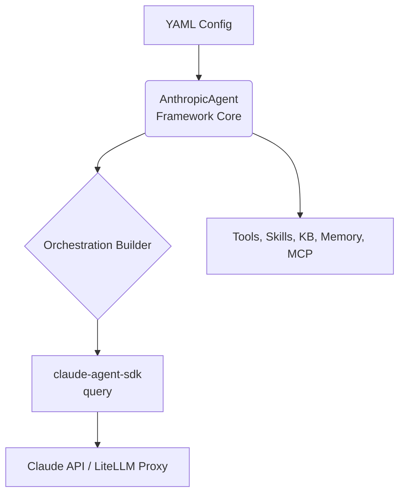

# Anthropic Multi-Agent Framework

A powerful, YAML-based configuration system for building multi-agent AI workflows with Claude via `claude-agent-sdk` and LiteLLM provider routing. Build complex agent orchestrations — including extended thinking, supervisor crews, and agent-as-tool patterns — without writing boilerplate code.

## 📖 Table of Contents

- [Overview](#overview)
- [Prerequisites](#prerequisites)
- [Quick Start](#quick-start)
- [Project Structure](#project-structure)
- [Key Features](#key-features)
- [Configuration](#configuration)
- [Orchestration Patterns](#orchestration-patterns)
- [Agents Configuration](#agents-configuration)
- [Tools System](#tools-system)
- [Agent Skills](#agent-skills)
- [Skills Registry](#skills-registry)
- [Structured Output](#structured-output)
- [Knowledge Base Integration](#knowledge-base-integration)
- [KB Registry Integration](#kb-registry-integration)
- [Data Sources](#data-sources)
- [Memory Management](#memory-management)
- [MCP Integration](#mcp-integration)
- [Lazy MCP Loading](#lazy-mcp-loading)
- [Guardrails Integration](#guardrails-integration)
- [Dynamic Input Variables](#dynamic-input-variables)
- [Usage Examples](#usage-examples)
- [Streaming Support](#streaming-support)
- [Observability](#observability)
- [Best Practices](#best-practices)
- [Troubleshooting](#troubleshooting)
- [API Reference](#api-reference)

## 📝 Overview

The Anthropic Multi-Agent Framework lets you create sophisticated Claude agent orchestrations through simple YAML configuration files. Built on `claude-agent-sdk` and LiteLLM, it provides:

- A **built-in agentic loop** — no manual tool-call iteration.
- **Sub-agents as first-class citizens** via `AgentDefinition` and the built-in `Agent` tool.
- **MCP servers configured once**, available to all agents automatically.
- **Extended thinking** — single-flag reasoning chain for complex tasks.
- **LiteLLM proxy routing** — point at a LiteLLM proxy and transparently route to Bedrock, Vertex AI, or the direct Anthropic API.

### High-Level Architecture



### What Can You Build?

- Single Claude agents with tools, knowledge bases, memory, and skills
- Supervisor crews where Claude delegates to specialised sub-agents
- Agent-as-tool patterns where sub-agents are called like functions
- Extended-thinking pipelines for deep reasoning tasks
- Enterprise-grade AI applications routed through a LiteLLM proxy

## ✅ Prerequisites

Set environment variables based on your deployment target:

```bash
# Direct Anthropic API
export ANTHROPIC_API_KEY="sk-ant-..."

# Via LiteLLM proxy (Bedrock / Vertex AI / any provider)
export LITELLM_PROXY_URL="http://localhost:4000"
export LITELLM_PROXY_API_KEY="lm-..."

# For Langfuse observability (optional)
export LANGFUSE_ENABLED=true
export LANGFUSE_PUBLIC_KEY=pk-xxx
export LANGFUSE_SECRET_KEY=sk-xxx
export LANGFUSE_HOST=https://cloud.langfuse.com
```

This framework uses [claude-agent-sdk](https://github.com/anthropics/claude-agent-sdk) for the agentic loop and [LiteLLM](https://docs.litellm.ai/) for provider routing. The `model.model_id` field in your YAML drives which Claude model is used. Authentication is passed to the Claude CLI subprocess via environment variables — no provider-specific SDK packages are required.

## 🚀 Quick Start

### Option 1: Use the Project Generator (Recommended)

The `oai-gen` CLI tool scaffolds a complete, production-ready project.

**1. Install the Generator**

```bash
mkdir agent_development
cd agent_development
python3.13 -m venv .venv
source .venv/bin/activate
pip install uv

uv pip install 'oai-template-generator @ git+https://github.com/Capgemini-Innersource/ptr_oai_agent_development_kit@main#subdirectory=packages/template-generator'
```

**2. Create a New Agent Project**

```bash
oai-gen new agent
```

Or provide arguments directly:

```bash
oai-gen new agent my_agent_project --author "Jane Doe" --email "jane.doe@capgemini.com"
```

Select **Anthropic** when prompted for the framework. The wizard generates a complete project structure with a pre-filled YAML configuration file ready to customise and run.

### Knowledge Base (RAG)
Supported backends: **Chroma** (local), **Postgres** (pgvector), **S3**.

### MCP Servers
- **`stdio`**: Local command-line servers (`command`, `args`, `env`).
- **`remote`**: HTTP servers (`url`, `headers`).

### Guardrails
A `guardrails` section is added with sample validators (`competitor_check`, `DetectPII`, `profanity_free`).

### Getting Started & Next Steps

```bash
cd <your_project_name>
source .venv/bin/activate
pip install uv
uv pip install -r requirements.txt
```

Open the generated `agents_config/<agent_name>.yaml` and review the settings.

### Option 2: Manual Setup

**1. Installation**

```bash
pip install oai-anthropic-core
```

With optional extras:

```bash
# ChromaDB vector store support
pip install "oai-anthropic-core[chromadb]"

# Postgres (pgvector) support
pip install "oai-anthropic-core[postgres]"

# S3 vector store support
pip install "oai-anthropic-core[s3]"

# Neo4j knowledge graph (GraphRAG) support
pip install "oai-anthropic-core[neo4j]"

# Guardrails AI support
pip install "oai-anthropic-core[guardrails]"

# All extras
pip install "oai-anthropic-core[all]"
```

**2. Create Your Configuration File**

```yaml
# research_agent.yaml
model:
  model_id: claude-opus-4-5-20251101
  api_key: ${ANTHROPIC_API_KEY}

agent_list:
  - researcher:
      system_prompt: You are a helpful research assistant.
```

**3. Initialize and Run**

```python
import yaml
from oai_agent_core.anthropic_core import AnthropicAgent

with open("research_agent.yaml") as f:
    config = yaml.safe_load(f)

agent = AnthropicAgent(
    agent_name="research_crew",
    agent_config=config,
)

await agent.initialize()
result = await agent.ainvoke("Summarise the latest trends in quantum computing")
print(result)
```

## 📁 Project Structure

```text
ptr_agent_servers_my_project/
├── agentic_registry_agents/
│   ├── agents/
│   │   └── my_agent/
│   │       ├── agent.py
│   │       └── server.py
│   ├── agents_config/
│   │   └── my_agent.yaml      # Full configuration (Model, Tools, KB, etc.)
│   └── utils/
│       └── my_agent_utils.py  # Scaffolded tool functions
├── .gitignore
├── docker-compose.yaml
├── Makefile
├── Dockerfile
├── pyproject.toml
├── README.md
└── tests/
```

## ✨ Key Features

### 🤖 claude-agent-sdk Integration
Built on Anthropic's `claude-agent-sdk` — a built-in agentic loop, sub-agents via `AgentDefinition`, first-class MCP support, hooks, and extended thinking.

### 🔄 Flexible Orchestration
Four supported patterns: `single`, `supervisor`, `agent-as-tool`, `extended-thinking`.

### 🔀 LiteLLM Proxy Routing
Route to AWS Bedrock, Google Vertex AI, or the direct Anthropic API by setting `model.litellm_proxy_url`. No code changes required.

### 🛠️ Extensible Tools System
Define Python functions as tools — they are automatically wrapped in an in-process FastMCP server and exposed to the Claude agentic loop.

### 🔌 First-Class MCP Support
Connect to stdio or remote MCP servers. Server configs are forwarded directly to `ClaudeAgentOptions`.

### 🧠 Extended Thinking
Enable Claude's reasoning chain via `crew_config.pattern: extended-thinking` and `anthropic_config.thinking_budget_tokens`.

### 🎯 Agent Skills
Group related prompts and workflows into reusable skills. Resolved from a local `skill_dir` or the central Skills Registry.

### 📝 Structured Output
Define output shape using Pydantic models. Serialised to a JSON schema and forwarded to `ClaudeAgentOptions.output_format`.

### 📚 Knowledge Base Support
KB search and load callables are exposed as FastMCP tools so Claude can call them directly during the agentic loop.

### 🧠 Long-Term Memory
Persistent memory store for maintaining context across sessions with semantic search capabilities.

### 🛡️ Guardrails Integration
Validate and sanitize both input and output using built-in or custom validators.

### 📊 Session Management
Built-in session tracking and output serialization for conversation continuity.

### 📈 Observability with Langfuse
Langfuse tracing via `claude-agent-sdk` hooks (`PreToolUse`, `PostToolUse`, `Stop`) for per-tool-call spans.

### ⚡ Streaming Support
Real-time streaming of agent output via `astream()`. On failure a final error chunk is yielded instead of raising.

## ⚙️ Configuration

The entire behaviour of your agent is defined in a single YAML file.

### Model ID Format (LiteLLM)

`model.model_id` can be a bare model name (direct API) or a LiteLLM-prefixed name (proxy routing):

| Target | `model_id` example |
|---|---|
| Direct Anthropic API | `claude-opus-4-5-20251101` |
| Bedrock via proxy | `bedrock/anthropic.claude-3-5-sonnet-20241022-v2:0` |
| Vertex AI via proxy | `vertex_ai/claude-3-5-sonnet@20241022` |

When a `litellm_proxy_url` is set, the LiteLLM prefix is forwarded as `ANTHROPIC_BASE_URL` to the Claude CLI subprocess. The bare model name (suffix after `/`) is passed to `ClaudeAgentOptions.model`.

### Model Parameters

Fields under `model` that affect model kwargs:

| Field | Description |
|---|---|
| `model_id` | Model identifier — LiteLLM-prefixed or bare |
| `api_key` | Auth key — used as `ANTHROPIC_API_KEY` in subprocess env |
| `litellm_proxy_url` | LiteLLM proxy URL — used as `ANTHROPIC_BASE_URL` in subprocess env |

> **Note:** Fields like `temperature`, `max_tokens`, and `params` are not forwarded to `ClaudeAgentOptions`. These parameters are configured in the LiteLLM proxy, not per-request. Use the `anthropic_config` block for SDK-level options such as prompt caching and beta features.

### Minimal Example

```yaml
model:
  model_id: claude-opus-4-5-20251101
  api_key: ${ANTHROPIC_API_KEY}

agent_list:
  - assistant:
      system_prompt: You are a helpful assistant.
```

### Complete YAML Template

```yaml
# 1. Model Configuration
model:
  model_id: anthropic/claude-opus-4-5-20251101   # LiteLLM model-ID format for proxy routing
  litellm_proxy_url: ${LITELLM_PROXY_URL}        # omit for direct Anthropic API
  api_key: ${LITELLM_PROXY_API_KEY}

# 2. Anthropic SDK Options
#    Controls claude-agent-sdk / Claude CLI behaviour.
anthropic_config:
  prompt_caching: true
  thinking_budget_tokens: 16000   # only used for the extended-thinking pattern
  betas: []                       # beta API features list

# 3. Architecture Configuration
crew_config:
  pattern: supervisor             # single | supervisor | agent-as-tool | extended-thinking
  entry_agent: coordinator        # name of the entry/supervisor agent (multi-agent patterns)
  enable_lazy_loading: true       # lazy-load MCP tool schemas on first use

# 4. Tools Definition (Python functions wrapped as FastMCP tools)
tools:
  my_tools:
    module: my_tool_module
    function_list:
      - my_function
    base_path: ./src

# 5. Skills Definition
skills:
  skill_dir: ./skills
  registry:
    url: http://localhost:8083/api/v1/skills-registry
    token: ""                     # overrides SKILLS_REGISTRY_AUTH_TOKEN

# 6. Structured Output
structured_output:
  script_dir: ./structured_output

# 7. Knowledge Base
knowledge_base:
  registry:
    url: http://localhost:8085    # overrides KB_REGISTRY_URL
    token: ""                     # overrides KB_REGISTRY_AUTH_TOKEN
  sources:                        # global context-augmentation KBs
    - name: company_docs
      description: Search company policies and procedures.
      retrieval_settings:
        top_k: 5
        score_threshold: 0.4

# 8. Memory
memory:
  vector_store:
    type: chroma
    settings:
      collection_name: chat_memory
      persist_directory: ./memory_db
  settings:
    max_recent_turns: 5
    max_relevant_turns: 3

# 9. MCP Servers (forwarded to ClaudeAgentOptions.mcp_servers)
mcps:
  filesystem_server:
    command: mcp-server-filesystem
    args:
      - /data

# 10. Guardrails
guardrails:
  validators:
    - name: profanity_check
      full_name: guardrails/profanity_free
      on_fail: fix
  output:
    validators:
      - ref: profanity_check

# 11. Agent Definitions
agent_list:
  - coordinator:
      system_prompt: You are a supervisor. Delegate tasks to the correct specialist.
      tools:
        - my_function
      skills:
        - my_skill
      knowledge_base:
        - name: company_docs
          description: Search company policy documents.
      structured_output_model: MyOutputModel

# 12. Top-level System Prompt (used when no entry_agent is set)
system_prompt: You are a helpful assistant.
```

## 🔗 Orchestration Patterns

### 1. Single Agent

**When to use:** Simple tasks requiring one Claude agent.

```yaml
crew_config:
  pattern: single

agent_list:
  - assistant:
      system_prompt: You are a helpful assistant.
      tools:
        - my_function
```

### 2. Multi-Agent Supervisor

**When to use:** Complex workflows where a supervisor delegates to specialised sub-agents via the built-in `Agent` tool.

```yaml
crew_config:
  pattern: supervisor
  entry_agent: coordinator

system_prompt: You are a supervisor. Delegate tasks to the correct specialist.

agent_list:
  - coordinator:
      system_prompt: You coordinate the team and route tasks.
  - researcher:
      system_prompt: You research topics and gather information.
  - writer:
      system_prompt: You write clear summaries based on provided research.
```

**Flow:**
```
User Input → Supervisor (coordinator) → (Agent tool) → Sub-Agent → (Returns) → Supervisor → Final Output
```

### 3. Agent as Tool

**When to use:** When you want the main agent to treat other specialised agents as callable tools.

```yaml
crew_config:
  pattern: agent-as-tool
  entry_agent: main_agent

system_prompt: You are a helpful assistant. Call specialist agents as needed.

agent_list:
  - main_agent:
      system_prompt: You are the main agent. Use specialist agents to answer questions.
  - math_expert:
      system_prompt: You solve math problems.
      description: Agent useful for solving math problems.
  - physics_expert:
      system_prompt: You explain physics concepts.
      description: Agent useful for physics questions.
```

**Flow:**
```
User Input → Main Agent → (Calls Agent tool) → Sub-Agent → (Returns Result) → Main Agent → Final Output
```

> In `claude-agent-sdk`, the `supervisor` and `agent-as-tool` patterns both use the built-in `Agent` tool. The difference is the `description` field on sub-agents, which guides the main agent's routing decisions.

### 4. Extended Thinking

**When to use:** Deep reasoning tasks where you want Claude to show its reasoning chain before responding.

```yaml
crew_config:
  pattern: extended-thinking

anthropic_config:
  thinking_budget_tokens: 16000

agent_list:
  - analyst:
      system_prompt: |
        You are a deep analyst. Think carefully before responding.
        Show your reasoning process.
```

**Flow:**
```
User Input → Claude (thinking enabled, budget_tokens=16000) → Reasoning Chain → Final Output
```

## 🤖 Agents Configuration

### Agent Properties Reference

| Property | Required | Description |
|---|---|---|
| `system_prompt` | ✅ Yes | Instructions that define the agent's role and behaviour |
| `tools` | No | List of function names from the global `tools` registry |
| `skills` | No | List of skill names — resolved from `skills.skill_dir` or the Skills Registry |
| `knowledge_base` | No | Flat list of KB entries for this agent's search tools |
| `mcps` | No | Agent-level MCP servers (merged with global `mcps`) |
| `structured_output_model` | No | Pydantic class name for structured JSON output |
| `description` | No | Tool description when this agent is used as a sub-agent tool |

### Full Agent Example

```yaml
model:
  model_id: anthropic/claude-opus-4-5-20251101
  litellm_proxy_url: ${LITELLM_PROXY_URL}
  api_key: ${LITELLM_PROXY_API_KEY}

anthropic_config:
  prompt_caching: true

tools:
  policy_tools:
    module: policy_tools
    function_list:
      - search_regulations
    base_path: ./src

skills:
  skill_dir: ./skills
  registry:
    url: http://localhost:8083/api/v1/skills-registry
    token: your-bearer-token

knowledge_base:
  registry:
    url: http://localhost:8085
    token: your-bearer-token

structured_output:
  script_dir: ./structured_output

agent_list:
  - policy_expert:
      system_prompt: |
        You are an expert on company policies. Search the knowledge base before
        answering and always cite the relevant document section.

      tools:
        - search_regulations

      skills:
        - insurance-qa-skill
        - claim-processing-skill

      knowledge_base:
        - name: insurance
          description: Search insurance policy documents.
          retrieval_settings:
            top_k: 5
            score_threshold: 0.4
        - name: hr_policies
          description: Search HR and leave policy documents.

      mcps:
        internal_api:
          url: http://api.internal.example.com/mcp
          headers:
            Authorization: Bearer ${INTERNAL_API_KEY}

      structured_output_model: PolicyAnswer

crew_config:
  pattern: supervisor
  entry_agent: policy_expert
```

### Knowledge Base — Agent Level

Agent-level KB entries are a flat list. When a top-level `knowledge_base.registry` block is defined, credentials are automatically injected:

```yaml
knowledge_base:
  registry:
    url: http://localhost:8085
    token: your-bearer-token

agent_list:
  - rag_assistant:
      knowledge_base:
        - name: insurance
          description: Search insurance policy documents.
          retrieval_settings:
            top_k: 3
            score_threshold: 0.4
        - name: hr_policies
          description: Search HR policy documents.
```

### Skills — Agent Level

```yaml
skills:
  skill_dir: ./skills
  registry:
    url: http://localhost:8083/api/v1/skills-registry
    token: your-bearer-token

agent_list:
  - assistant:
      skills:
        - pdf-processing
        - data-validator
        - local-only-skill
```

### `agent_list` Entry Styles

Entries may be either a **dict** (`{name: config}`) or a plain **string** (`name`). String entries trigger a config file lookup from the `config_root` directory:

```yaml
# Dict style (inline config)
agent_list:
  - researcher:
      system_prompt: You research topics.

# String style (config loaded from config_root/agents_config/researcher.yaml)
agent_list:
  - researcher
```

## 🛠️ Tools System

Python tools defined in your YAML are loaded from the specified module, then automatically wrapped in an **in-process FastMCP server** by `AnthropicToolRegistry`. The Claude agentic loop calls them via the MCP protocol — no manual tool dispatch is needed.

### Defining Tools

#### Custom Module Tools

```yaml
tools:
  my_tools:
    module: my_tools
    function_list:
      - search_web
      - fetch_document
    base_path: ./src
```

### Setting Default Parameter Values

```yaml
tools:
  data_tools:
    module: data_tools
    function_params:
      fetch_report:
        format: json
        max_rows: 100
```

## 🧠 Agent Skills

Agent Skills modularise complex behaviours into reusable components. Each skill is a `SKILL.md` file with YAML frontmatter and step-by-step instructions injected into the agent's context at startup.

For more information see the [Agent Skills Documentation](https://agentskills.io/skill-creation/quickstart).

### How Skills Work

1. Define a `skill_dir` in your project.
2. Create `skills/<skill_name>/SKILL.md` with frontmatter and instructions.
3. Assign skills to agents in the YAML `skills` list.
4. The framework reads the `SKILL.md` files and injects their contents into the agent's system prompt at runtime.

### Example Skill

```bash
mkdir skills
mkdir skills/file-processing
touch skills/file-processing/SKILL.md
```

*`skills/file-processing/SKILL.md`*:

```markdown
---
name: file-processing
description: Process and analyze CSV, JSON, and text files.
allowed-tools:
  - shell
---

# File Processing Skill

## Purpose
Process structured data files with comprehensive capabilities.

## Instructions
1. Understand the user's requested analysis.
2. Use the `shell` tool to write Python scripts that read the target files.
3. Apply the requested transformations (filtering, sorting).
4. Format the output as a Markdown table.
```

### Agent Configuration

```yaml
skills:
  skill_dir: ./skills

agent_list:
  - data_assistant:
      system_prompt: You are a data processing assistant.
      skills:
        - file-processing
```

## 📝 Skills Registry

The **Skills Registry** is a centralized service that manages skills as versioned, shared assets.

### Configuration

```yaml
skills:
  skill_dir: ./skills   # optional local fallback
  registry:
    url: http://localhost:8083/api/v1/skills-registry   # overrides SKILLS_REGISTRY_URL
    token: your-bearer-token                             # overrides SKILLS_REGISTRY_AUTH_TOKEN

agent_list:
  - rag_assistant:
      system_prompt: |
        You are a helpful insurance assistant. Use your knowledge base tools
        to answer questions accurately and always cite the relevant policy section.
      skills:
        - insurance-qa-skill
        - claim-processing-skill
```

### Environment Variables vs. YAML Config

| Priority | Source |
|---|---|
| 1 (highest) | `skills.registry.url` / `.token` in the YAML |
| 2 | `SKILLS_REGISTRY_URL` / `SKILLS_REGISTRY_AUTH_TOKEN` environment variables |

## 📊 Structured Output

Structured output is powered by `ClaudeAgentOptions.output_format`. The framework resolves the named Pydantic model to a JSON schema and forwards it directly to the SDK.

### Example

**`structured_output/models.py`**:

```python
from pydantic import BaseModel, Field

class PolicyAnswer(BaseModel):
    answer: str = Field(description="Direct answer to the policy question.")
    source_section: str = Field(description="Document section the answer was sourced from.")
    confidence: float = Field(description="Confidence score between 0.0 and 1.0.")
```

**YAML configuration**:

```yaml
structured_output:
  script_dir: ./structured_output

agent_list:
  - policy_expert:
      system_prompt: Answer policy questions using the knowledge base.
      structured_output_model: PolicyAnswer
```

### Supervisor-Level Structured Output

```yaml
crew_config:
  pattern: supervisor
  structured_output_model: FinalReport

structured_output:
  script_dir: ./structured_output

system_prompt: You are a supervisor managing a research team.

agent_list:
  - researcher:
      system_prompt: You gather information.
  - writer:
      system_prompt: You write sections of the report.
```

## 📚 Knowledge Base Integration

KB search and load callables are registered as FastMCP tools so the Claude agentic loop can call them directly.

### How It Works

1. You provide documents via local files, S3, or LangChain document loaders.
2. The framework indexes and stores content in a vector database.
3. KB tools are wrapped as FastMCP callables and exposed to the Claude agentic loop.
4. Claude decides when to call them based on the tool description.

### Configuration

```yaml
knowledge_base:
  - name: company_policies_kb
    description: Use this to answer questions about HR policies and internal procedures.

    vector_store:
      type: chroma
      settings:
        collection_name: company_policies
        persist_directory: ./rag_db

    embedding:
      model_id: bedrock/amazon.titan-embed-text-v1
      region_name: us-west-2

    data_sources:
      - type: file
        path: docs/hr_policy.pdf
      - type: s3
        bucket: my-company-docs
        prefix: policies/

    text_splitter:
      type: recursive_character
      chunk_size: 1000
      chunk_overlap: 200

    retrieval_settings:
      top_k: 5
      score_threshold: 0.7
```

### Vector Store Options

#### ChromaDB
```yaml
vector_store:
  type: chroma
  settings:
    collection_name: my_local_kb
    persist_directory: ./data/chroma_db
```

#### Postgres (pgvector)
```yaml
vector_store:
  type: postgres
  settings:
    collection_name: my_production_kb
    db_host: localhost
    db_port: 5432
    db_user: myuser
    db_name: mydatabase
    # Set DB_PASSWORD_MYDATABASE as an environment variable
```

#### S3
```yaml
vector_store:
  type: s3
  settings:
    collection_name: my_s3_kb
    bucket_name: my-vector-data-bucket
    prefix: indexes/
```

#### Neo4j Knowledge Graph (GraphRAG)
**Read-only** — assumes the graph is already loaded by a governed pipeline. Best for structured, connected data where relationships matter.
```yaml
vector_store:
  type: neo4j_graph
  settings:
    url: bolt://localhost:7687
    username: neo4j               # use a read-only role in production
    password: ${NEO4J_PASSWORD}
    database: neo4j
    retrieval_mode: traversal     # traversal | text2cypher
    entry_strategy: fulltext      # fulltext | entity_linking | vector (hybrid)
    fulltext_index: entityNames   # an existing Neo4j full-text index
    max_hops: 2
```
Install the extra: `pip install "oai-anthropic-core[neo4j]"`

**Retrieval modes**
- **`traversal`** (default, deterministic) — find entry nodes, then expand an N-hop neighbourhood. Entry strategies: `fulltext`, `entity_linking` (LLM extracts entities), or `vector` (semantic, node-level hybrid).
- **`text2cypher`** — the LLM generates a **read-only** Cypher query from the introspected schema (hardened prompts; mutating queries are refused). Best for aggregate / multi-hop questions.

**Hybrid (node-level vector entry):** set `entry_strategy: vector` and add a `vector_entry` index of node embeddings so natural-language questions map to graph entry nodes.

## 📝 KB Registry Integration

The **KB Registry** is a shared service that pre-indexes documents and exposes a search API. All agents call the registry over HTTP — no local vector DB connection required.

### Configuration (Recommended Style)

#### Global KB (context augmentation)

```yaml
knowledge_base:
  registry:
    url: http://localhost:8085
    token: dummy-token
  sources:
    - name: insurance
      description: Search insurance policy documents.
      retrieval_settings:
        top_k: 5
        score_threshold: 0.4

agent_list:
  - rag_assistant:
      system_prompt: Answer questions using the knowledge base. Always cite sources.

crew_config:
  pattern: single
```

#### Agent-Specific KB as Tools

```yaml
knowledge_base:
  registry:
    url: http://localhost:8085
    token: dummy-token

agent_list:
  - rag_assistant:
      system_prompt: |
        Use the insurance knowledge base for coverage questions and the
        leave_policies knowledge base for HR questions. Always cite sources.

      knowledge_base:
        - name: insurance
          description: >
            Search insurance policy documents for coverage details, premium
            information, claim procedures, and policy terms.
          retrieval_settings:
            top_k: 3
            score_threshold: 0.4

        - name: leave_policies
          description: >
            Search leave policy documents for entitlements, approval workflows,
            carry-forward rules, and emergency leave procedures.
```

### Environment Variables vs. YAML Config

| Priority | Source |
|---|---|
| 1 (highest) | Per-entry `registry_url` / `auth_token` keys (backward-compat) |
| 2 | `knowledge_base.registry.url` / `.token` in the YAML |
| 3 | `KB_REGISTRY_URL` / `KB_REGISTRY_AUTH_TOKEN` environment variables |

### Retrieval Settings Override

```yaml
retrieval_settings:
  top_k: 3
  score_threshold: 0.4
```

If `retrieval_settings` is omitted, the values configured in the KB Registry are used.

## 💾 Data Sources

```yaml
knowledge_base:
  - name: my_knowledge_base
    data_sources:
      # Local file
      - type: file
        path: /path/to/documents/*.pdf

      # S3 bucket
      - type: s3
        bucket: my-company-docs-bucket
        prefix: manuals/

      # LangChain document loader
      - loader: langchain_community.document_loaders.ConfluenceLoader
        settings:
          url: https://your-company.atlassian.net/wiki
          username: ${CONFLUENCE_USERNAME}
          api_key: ${CONFLUENCE_API_KEY}
          space_key: INSURANCE
```

> **Note:** Values prefixed with `$` are automatically resolved from environment variables.

## 🧠 Memory Management

```yaml
memory:
  vector_store:
    type: chroma
    settings:
      collection_name: chat_history_db
      persist_directory: ./memory_db

  embedding:
    model_id: bedrock/amazon.titan-embed-text-v1
    region_name: us-west-2

  settings:
    max_recent_turns: 5
    max_relevant_turns: 3
    similarity_threshold: 0.6
```

## 🔌 MCP Integration

MCP server configs are forwarded directly to `ClaudeAgentOptions.mcp_servers`. The `claude-agent-sdk` manages the full connection lifecycle.

### Global MCP Servers

```yaml
mcps:
  # stdio server
  filesystem_access:
    command: mcp-server-filesystem
    args:
      - /path/to/allowed/directory

  # Remote HTTP server
  remote_database_api:
    url: http://api.internal.mycompany.com/mcp
    headers:
      Authorization: Bearer ${DATABASE_API_KEY}
```

### Agent-Level MCP Servers

```yaml
agent_list:
  - analyst:
      system_prompt: You analyse data.
      mcps:
        internal_api:
          url: http://api.internal.example.com/mcp
          headers:
            Authorization: Bearer ${INTERNAL_API_KEY}
```

### In-Process Python Tools (FastMCP)

Python functions defined under `tools` are wrapped in an in-process **FastMCP server** (registered as `custom_tools`). This server is registered alongside external MCP servers in `ClaudeAgentOptions`. Claude calls them via the MCP protocol — no manual dispatch needed.

```python
# my_tools.py
def search_regulations(query: str, jurisdiction: str = "UK") -> str:
    """Search regulatory documents for the given query."""
    ...
    return results
```

```yaml
tools:
  policy_tools:
    module: my_tools
    function_list:
      - search_regulations
    base_path: ./src
```

Claude sees `search_regulations` as a standard MCP tool and calls it automatically.

## ⏳ Lazy MCP Loading

Enable lazy loading to reduce initial startup time when many MCP tools are available.

```yaml
crew_config:
  pattern: supervisor
  enable_lazy_loading: true
```

When enabled, the agent discovers tool names at startup but fetches full schemas only when a tool is first needed.

## 🛡️ Guardrails Integration

```yaml
guardrails:
  enable_agent_validation: false
  custom_validators_dir: custom_guardrails

  validators:
    - name: profanity_check
      full_name: guardrails/profanity_free
      on_fail: fix

    - name: competitor_check
      full_name: guardrails/competitor_check
      on_fail: filter
      parameters:
        competitors:
          - Acme Corp
          - Global Tech

    - name: internal_code_check
      full_name: InternalCodeValidator
      module: internal_code_validator
      on_fail: exception

  input:
    validators:
      - ref: profanity_check

  output:
    validators:
      - ref: profanity_check
      - ref: competitor_check
      - ref: internal_code_check
```

## 💡 Dynamic Input Variables

### Variable Syntax

```yaml
agent_list:
  - researcher:
      system_prompt: |
        Research the topic: {topic}
        Focus on {aspect} in the {industry} industry.
```

### Providing Inputs

**Method 1: Configuration Object**
```python
result = await agent.ainvoke(
    "Research quantum computing",
    config={
        "inputs": {
            "topic": "Quantum Computing",
            "aspect": "commercial applications",
            "industry": "finance",
        }
    },
)
```

**Method 2: Simple Message**
```python
# System auto-detects and maps variables
result = await agent.ainvoke("Quantum Computing")
```

## 💡 Usage Examples

### Example 1: Direct Anthropic API

```yaml
model:
  model_id: claude-opus-4-5-20251101
  api_key: ${ANTHROPIC_API_KEY}

agent_list:
  - assistant:
      system_prompt: You are a helpful assistant.
```

### Example 2: Via LiteLLM Proxy (Bedrock)

```yaml
model:
  model_id: bedrock/anthropic.claude-3-5-sonnet-20241022-v2:0
  litellm_proxy_url: ${LITELLM_PROXY_URL}
  api_key: ${LITELLM_PROXY_API_KEY}

agent_list:
  - assistant:
      system_prompt: You are a helpful assistant.
```

### Example 3: Extended Thinking

```yaml
model:
  model_id: claude-opus-4-5-20251101
  api_key: ${ANTHROPIC_API_KEY}

anthropic_config:
  thinking_budget_tokens: 16000

crew_config:
  pattern: extended-thinking

agent_list:
  - deep_analyst:
      system_prompt: |
        You are a deep analytical thinker. Work through complex problems step by step
        before providing a final answer.
```

### Example 4: Multi-Agent Supervisor with KB and MCP

```yaml
model:
  model_id: anthropic/claude-opus-4-5-20251101
  litellm_proxy_url: ${LITELLM_PROXY_URL}
  api_key: ${LITELLM_PROXY_API_KEY}

anthropic_config:
  prompt_caching: true

crew_config:
  pattern: supervisor
  entry_agent: coordinator

knowledge_base:
  registry:
    url: http://localhost:8085
    token: ${KB_REGISTRY_AUTH_TOKEN}

mcps:
  filesystem:
    command: mcp-server-filesystem
    args:
      - /data

agent_list:
  - coordinator:
      system_prompt: You coordinate the team and route tasks to the correct specialist.

  - policy_expert:
      system_prompt: You answer questions using the insurance knowledge base.
      knowledge_base:
        - name: insurance
          description: Search insurance policy documents.

  - data_analyst:
      system_prompt: You analyse data files using the filesystem MCP server.

system_prompt: You are a supervisor. Delegate tasks to the coordinator.
```

```python
import yaml
from oai_agent_core.anthropic_core import AnthropicAgent

with open("multi_agent.yaml") as f:
    config = yaml.safe_load(f)

agent = AnthropicAgent(
    agent_name="insurance_crew",
    agent_config=config,
    session_id="user-session-123",
    user_id="user-456",
)
await agent.initialize()

# Async invocation
result = await agent.ainvoke("What is the excess on my home insurance policy?")
print(result["content"]["text"])

# Sync invocation (loop-safe: uses a worker thread if a loop is already running)
result = agent.invoke("What is the excess on my home insurance policy?")
```

## ⚡ Streaming Support

### Async Streaming

```python
async for chunk in agent.astream("Summarise the insurance policy"):
    content = chunk.get("content")
    if isinstance(content, dict) and content.get("text"):
        print(content["text"], end="", flush=True)
    elif chunk.get("type") == "error":
        print(f"\n[stream error] {content}")
```

On stream failure, `astream()` yields a final error payload instead of raising an exception:

```python
{"content": {"text": "Error: <message>"}, "type": "error", "final": True}
```

> **Note:** `stream()` raises `NotImplementedError`. Always use `astream()` for streaming from `AnthropicAgent`.

## 📈 Observability

### Langfuse Integration

Enable tracing by setting environment variables:

```bash
export LANGFUSE_ENABLED=true
export LANGFUSE_PUBLIC_KEY=pk-xxx
export LANGFUSE_SECRET_KEY=sk-xxx
export LANGFUSE_HOST=https://cloud.langfuse.com
```

Langfuse integration uses `claude-agent-sdk` hooks:

- **`PreToolUse`** — opens a Langfuse span for each tool call.
- **`PostToolUse`** — closes the span with result and duration.
- **`Stop`** — flushes cost and usage to the top-level trace.

### Session Management

```python
agent = AnthropicAgent(
    agent_name="my_agent",
    agent_config=config,
    session_id="user-session-123",
    user_id="user-456",
)
```

## 👍 Best Practices

1. **Clear Agent Roles**: Define specific responsibilities for each agent to avoid confusion.
2. **Tool Scoping**: Use `function_list` to expose only the functions each agent needs.
3. **Supervisor Prompts**: For multi-agent systems, the supervisor's prompt must clearly define the workflow and delegation strategy.
4. **Extended Thinking Budget**: Start with `thinking_budget_tokens: 8000` and increase only for complex reasoning tasks — larger budgets add latency and cost.
5. **Proxy URL**: Use `litellm_proxy_url` to route to Bedrock or Vertex AI without any code changes. Keep `model_id` in LiteLLM-prefix format when using a proxy.
6. **Security**: Use `${ENV_VAR}` expansion for API keys and sensitive data. Never hardcode credentials.
7. **Lazy Loading**: Enable `crew_config.enable_lazy_loading: true` for agents with many MCP tools to reduce startup time.

## 🐛 Troubleshooting

**Issue: `ImportError: claude-agent-sdk is required`**
```bash
pip install claude-agent-sdk
```

**Issue: "Agent not initialized"**
```python
# Always call initialize() before invoking
await agent.initialize()
```

**Issue: `NotImplementedError` when calling `stream()`**
```python
# Use astream() instead — stream() is not implemented for AnthropicAgent
async for chunk in agent.astream("..."):
    ...
```

**Issue: Agent not routing via LiteLLM proxy**
```yaml
# Check that litellm_proxy_url is set and model_id uses the LiteLLM prefix
model:
  model_id: anthropic/claude-opus-4-5-20251101
  litellm_proxy_url: ${LITELLM_PROXY_URL}
  api_key: ${LITELLM_PROXY_API_KEY}
```

**Issue: Tool not found in the agentic loop**
```yaml
# Ensure the function is listed under function_list in the tools block
tools:
  my_tools:
    module: my_tools
    function_list:
      - my_missing_function
```

## 📖 API Reference

### AnthropicAgent Class

The main class for creating and managing Anthropic agents.

```python
class AnthropicAgent:
    def __init__(
        self,
        agent_name: str,
        agent_config: Optional[Dict[str, Any]] = None,
        llm: Optional[Dict[str, Any]] = None,
        session_id: str = "default",
        user_id: str = "default",
        config_root: Optional[str] = None,
        document_loader: Optional[Any] = None,
        vector_store: Optional[Any] = None,
        **kwargs,
    ):
        """
        Initialises the agent.

        - agent_name:      A unique name for this agent instance.
        - agent_config:    Optional dict loaded from your YAML configuration file.
        - llm:             Optional pre-built model kwargs dict forwarded directly
                           to ClaudeAgentOptions (e.g. {"model": "claude-opus-4-5",
                           "env": {"ANTHROPIC_API_KEY": "..."}}). When provided,
                           the YAML model block is not used for model selection.
        - session_id:      Identifier for the current conversation session.
        - user_id:         Identifier for the user interacting with the agent.
        - config_root:     Root directory for agent config files (used when
                           agent_list entries are string names).
        - document_loader: Optional custom document loader implementation.
        - vector_store:    Optional custom vector store implementation.
        - kwargs:          Additional options forwarded to the shared base class.
        """

    async def initialize(session_id: Optional[str] = None) -> None:
        """
        Resolves YAML config into claude-agent-sdk structures.

        Steps:
        1. Load KB, memory, and skills via BaseAgent helpers.
        2. Register global MCP server configs.
        3. Wrap Python tools in an in-process FastMCP server.
        4. Register KB search/load callables as FastMCP tools.
        5. Build AgentDefinition objects for all sub-agents.
        6. Wire up the OrchestrationBuilder with Langfuse hooks.

        Must be called before any invocation method.
        """

    async def ainvoke(user_message: str, config: Dict = None) -> Dict:
        """
        Asynchronously invokes the agent and returns a formatted ADK response dict.

        - user_message: The user's input string.
        - config:       Optional dict supporting:
                          inputs                   — template variable substitutions
                          include_raw              — include raw SDK result in response
                          include_input_message    — include augmented input in response
                          include_original_message — include original user message in response
                          original_message         — override original message for memory

        Returns a dict with shape:
            {
                "content":     {"text": "...", "type": "AIMessage",
                                "final": True, "session_id": "..."},
                "model":       {"model_id": "...", "model_provider": "..."},
                "token_usage": {...},
                "metadata":    {...},
            }
        """

    def invoke(user_message: str, config: Dict = None) -> Dict:
        """
        Synchronously invokes the agent (blocking).

        - If no event loop is active in the current thread, drives asyncio directly.
        - If a loop is already running (notebooks, ASGI, async frameworks),
          runs ainvoke() in a dedicated worker thread.

        Prefer await agent.ainvoke(...) in async code paths.
        """

    async def astream(user_message: str, config: Dict = None) -> AsyncGenerator:
        """
        Streams agent output as it is generated by claude-agent-sdk.

        Yields dicts with shape:
            {"content": {"text": "...", "type": "AIMessage"}, "final": bool}

        On failure, yields one final error payload and stops:
            {"content": {"text": "Error: ..."}, "type": "error", "final": True}
        """

    def get_agent_info() -> Dict[str, Any]:
        """
        Returns summary information about the agent's current state:
            agent_name, session_id, initialized, pattern,
            sub_agents, model, via_proxy, mcp_servers.
        """

    def validate_tasks() -> Dict[str, Any]:
        """
        Returns agent_count, agent names, orchestration pattern,
        and registered MCP server names from the current configuration.
        """
```

